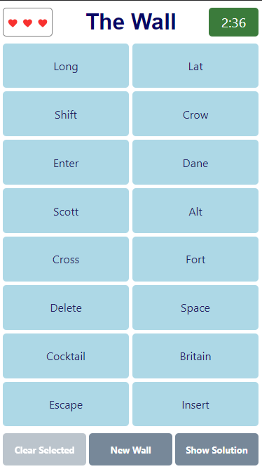

# Only Connect - The Connecting Wall

## How to Play

The game is currently live [here](http://206.189.19.65/).

Given a 'wall' of 16 tiles, the player has three minutes to correctly arrange the tiles into four groups of four, such that each group contains tiles which share a connection. Walls typically contain 'red herrings', where 5 or more tiles might fit a certain category, but there is only one way to correctly arrange the entire wall into four groups of four. For example, on the following wall, there are seven computer keyboard keys (Shift, Enter, Alt, Delete, Space, Escape, Insert):

The player has unlimited attempts to guess the first two groups, but once two groups have been guessed, the player only has three chances to correctly split the remaining eight tiles into two groups.

## Disclaimer

Both the format of the game and the walls themselves are taken directly from the BBC quiz show Only Connect, and I make no attempt to pass this intellectual property off as my own. I have simply adapted the game into a free-to-play (no adverts) web app for fans of the show.

## Implementation

The game logic and backend are written in Python, and the frontend is written in React. Each part of the application has a Dockerfile, and at the root of the project is a `docker-compose.yml` file. Run `docker-compose up --build` to launch application.
